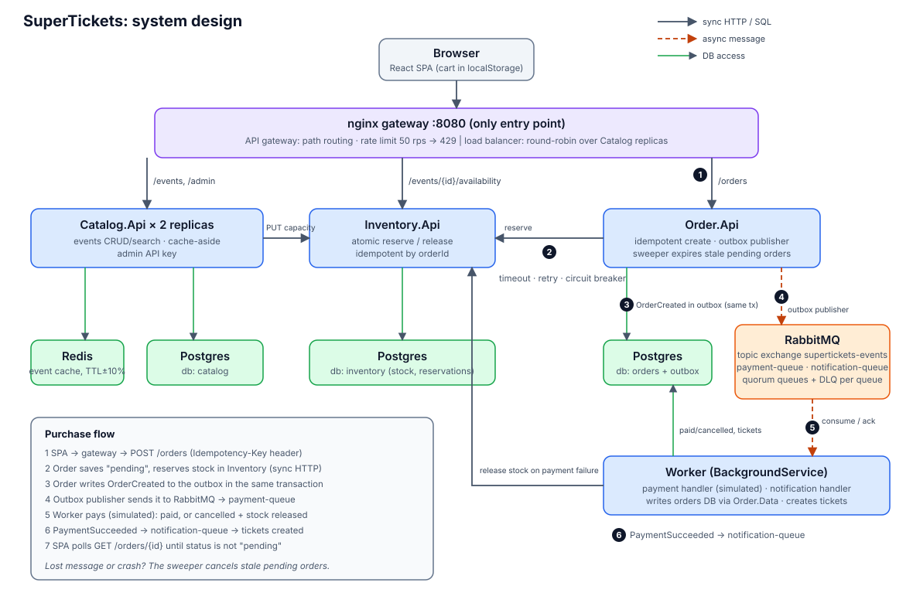

# SuperTickets

A study project about microservices and the related distributed-systems subjects: cache, message broker, load balancer, API gateway. It is a minimal ticket-selling app built to learn and practice these patterns, not a production marketplace.

## Docs

Everything lives under [docs/](docs/README.md): `project/` (specs), `learn/` (study guides), `diagrams/`.

| Doc | Content |
|---|---|
| [Learn guides](docs/learn/README.md) | Concepts (cache, broker, outbox, idempotency, saga, load balancer, ...) and how this repo applies them, plus a hands-on [case-studies lab](docs/learn/case-studies.md) |
| [business-plan.md](docs/project/business-plan.md) | Scope and business rules |
| [tech-plan.md](docs/project/tech-plan.md) | Architecture, resilience patterns, local run |
| [contracts.md](docs/project/contracts.md) | Routes, payloads, messages, schemas, config, ports |
| [tasks.md](docs/project/tasks.md) | Work breakdown, parallel waves |
| [CLAUDE.md](CLAUDE.md) | Conventions for coding agents |

## AI-native

Agents do most of the design, code and docs; a human reviews. The docs are the source of truth and change in the same PR as the decision. Contracts are fixed up front so tasks run in parallel against stubs.

## Flow

Admin creates an event → guest buys tickets (email only) → payment simulated → async processing → tickets generated. Unresolved pending orders expire and release stock.

## Services

| Service | Role |
|---|---|
| React SPA | Browse, buy, admin |
| Catalog | Events, Redis cache, admin API key |
| Inventory | Stock, reserve/release, no overselling |
| Order | Orders, outbox, pending-order expiry |
| Worker | Payment simulation, ticket generation |

Stack: .NET 10 Minimal APIs (Vertical Slice Architecture), React + Vite + shadcn/ui, PostgreSQL, Redis, RabbitMQ, nginx. Everything runs in Docker Compose; no cloud account needed.

## Run

- **Local:** `docker compose up --build -d --wait` (Postgres, Redis, RabbitMQ, nginx gateway); the app is at http://localhost:8080, RabbitMQ UI at http://localhost:15672 (guest/guest). See [tech-plan.md](docs/project/tech-plan.md#local-run). Verify with `scripts/smoke.sh [BASE_URL] [--no-toggles]` (`--no-toggles` skips the failure-toggle checks; about 3 min with them).
- **Build and test:** `dotnet build` and `dotnet test` (Testcontainers needs Docker); SPA: `npm ci && npm run build` in `src/web`. More commands in [CLAUDE.md](CLAUDE.md#commands).

## Status

All tasks implemented. Not yet verified against a live Compose stack: run `docker compose up --build -d --wait` and `scripts/smoke.sh`. See [tasks.md](tasks.md).
