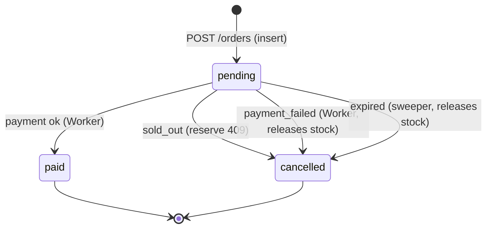

# Saga and compensation

**In one sentence:** a saga replaces one impossible distributed transaction with a chain of local transactions, each paired with a compensating action that undoes it if a later step fails.

## The problem

Buying tickets touches three owners: Inventory (stock), Order (status, payment) and Worker (tickets). Each has its own database, so no single `BEGIN ... COMMIT` can span them. Suppose stock is reserved (Inventory committed) and then the payment is declined. If nothing reacts, 2 tickets stay locked forever for an order nobody will pay. Or the Order service crashes right after reserving: the order sits `pending` and the stock leaks. Two-phase commit across services would block on the slowest participant and is exactly what microservices avoid.

## The concept

A **saga** is a sequence of local transactions T1, T2, ... Tn. If Tk fails, run compensations Ck-1 ... C1 (semantic undo, not a rollback: "release the reservation", not "erase history").

- **Orchestration:** a central coordinator tells each participant what to do next and what to compensate. Easy to follow, but a new component to build and keep available.
- **Choreography:** no coordinator; each service reacts to events and emits its own. Loose coupling, but the flow is implicit and spread over several services.

Compensations must be idempotent (they may run twice) and the saga needs a safety net for steps that never report back, usually a timeout.



Only `pending` has outgoing edges; `paid` and `cancelled` are terminal.

## How SuperTickets applies it

This project is **choreography via events plus a sweeper** (no orchestrator). Flow, per [tech-plan.md › Purchase flow](../project/tech-plan.md) and [contracts.md › Flows](../project/contracts.md):

| Step | Local transaction | Compensation |
|---|---|---|
| 1 | Order inserts `pending` ([CreateOrder](../../src/Order.Api/Features/CreateOrder/CreateOrder.cs)) | cancel/expire |
| 2 | Inventory reserves ([ReserveStock](../../src/Inventory.Api/Features/ReserveStock/ReserveStock.cs)) | release ([ReleaseReservation](../../src/Inventory.Api/Features/ReleaseReservation/ReleaseReservation.cs)) |
| 3 | `OrderCreated` through the outbox; Worker pays ([PaymentConsumer](../../src/Worker/Features/ProcessPayment/PaymentConsumer.cs)) | on failure: order `cancelled`/`payment_failed` + release |
| 4 | `PaymentSucceeded` creates tickets ([NotificationConsumer](../../src/Worker/Features/SendNotification/NotificationConsumer.cs)) | none needed: payment already succeeded; retries then DLQ |

Compensation paths:

- **Sold out:** reserve returns 409; `CreateOrder` cancels with `sold_out` and answers 409.
- **Payment failure:** `PayAsync` updates the order, writes the `payments` row and the `PaymentFailed` outbox event in one transaction, then `HandleAsync` calls `InventoryClient.ReleaseAsync`. If release throws, the message is redelivered; the stored payment outcome is reused, so only the release repeats ([idempotency](06-idempotency.md)).
- **Lost message / crashed worker / abandoned client:** the [Sweeper](../../src/Order.Api/Features/ExpirePending/Sweeper.cs) runs every `Orders__SweepIntervalSeconds` (30), picks `pending` orders older than `Orders__PendingTimeoutMinutes` (5), releases stock, then sets `cancelled`/`expired`. If release fails, the order stays `pending` and is retried next pass: release first, cancel second, so stock is never leaked.
- **Inventory down at order time:** the order stays `pending` and the client gets 503; a retry with the same key resumes, otherwise the sweeper cleans up.

**Why status updates are guarded.** Payment, the sweeper and the sold-out branch can race for the same order (a slow payment arriving after expiry, say). Every update is `WHERE status = 'pending'`; the first writer wins, later ones affect 0 rows and do nothing. This also makes `paid` and `cancelled` truly terminal: a cancelled order can never become paid, so stock released by the sweeper is never also sold. `PayAsync` returns null in that case and the handler skips payment.

`PaymentFailed` has no subscriber; it is an observability event only ([04-message-broker.md](04-message-broker.md)). Events are published by the outbox ([05-transactional-outbox.md](05-transactional-outbox.md)).

## Try it

```bash
# Force every payment to fail: set Payment__FailureRate=1 on worker (docker-compose.yml), then
docker compose up -d worker
EV=<event id>; curl -s localhost:8080/events/$EV/availability          # before
curl -s -X POST localhost:8080/orders -H 'Idempotency-Key: saga-1' -H 'Content-Type: application/json' \
  -d "{\"eventId\":\"$EV\",\"quantity\":3,\"customerEmail\":\"a@b.com\"}" | jq -r .id   # ORDER
sleep 3; curl -s localhost:8080/orders/$ORDER | jq '{status,cancelReason}'  # cancelled / payment_failed
curl -s localhost:8080/events/$EV/availability                          # restored

# Expiry: stop the worker so nothing pays, set Orders__PendingTimeoutMinutes=1, wait ~90 s
docker compose stop worker
docker compose exec postgres psql -U postgres -d orders -c "select id,status,cancel_reason from orders order by created_at desc limit 3"
docker compose exec postgres psql -U postgres -d inventory -c "select order_id,status from reservations"
```

`scripts/smoke.sh` runs the forced-failure scenario end to end (about 1-2 minutes with toggles).

## Trade-offs and what we did NOT do

- No orchestrator or saga log: the overall flow lives in four files and the contracts doc. Cheap, but you must read several services to see it.
- Eventual consistency: for a moment the order is `pending` while stock is already held. The SPA polls `GET /orders/{id}`.
- Reservations hold stock for up to the timeout even for abandoned carts; there is no soft "cart hold".
- The sweeper is a poll, not a timer per order; worst-case expiry is timeout plus one interval.
- No refund step: payment is simulated, and tickets are generated only after payment, so there is nothing to compensate afterwards.

## Check yourself

1. Which service owns the compensation for a declined payment, and what exactly does it undo?
2. Why does the sweeper release stock before marking the order `cancelled`?
3. What prevents a late payment from turning an expired order into `paid`?
4. Is this orchestration or choreography? What plays the coordinator's safety-net role?

<details><summary>Answers</summary>

1. The Worker, in `PaymentConsumer`: it cancels the order (`payment_failed`) and calls the idempotent Inventory release to give the stock back.
2. If the cancel came first and release failed, nobody would retry (the order is no longer `pending`) and stock would leak. Release-first leaves a retryable `pending` order.
3. The `AND status = 'pending'` guard: the update matches 0 rows, so `PayAsync` returns null and payment is skipped.
4. Choreography (events through the broker); the sweeper acts as the timeout safety net.
</details>

## Further reading

- Hector Garcia-Molina and Kenneth Salem, "Sagas" (1987); Chris Richardson, *Microservices Patterns* (saga chapter).
- Orchestration engines for contrast: Temporal, MassTransit sagas, AWS Step Functions.
- Next: [08-concurrency-and-inventory.md](08-concurrency-and-inventory.md); rules in [business-plan.md](../project/business-plan.md).
