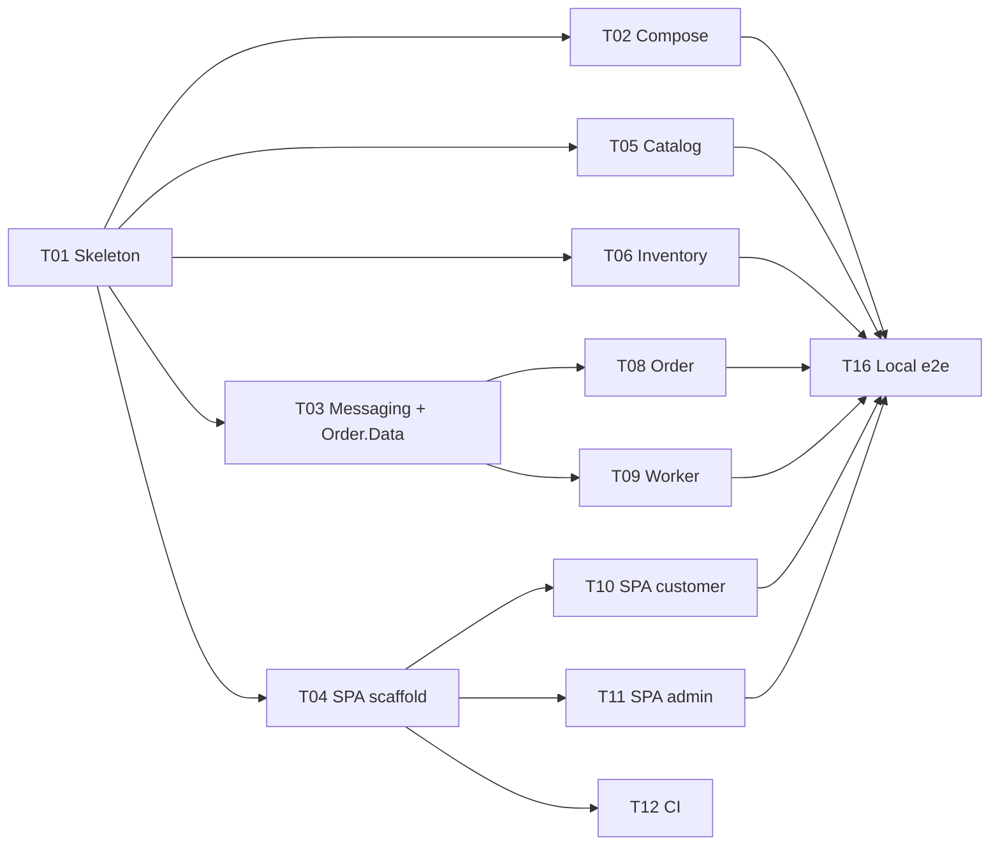

# Tasks

One task = one agent = one branch = one PR. A task starts when its dependencies are merged. Build against [contracts.md](contracts.md) and stub other services; don't wait for them.

## Graph

| Wave | Parallel tasks |
|---|---|
| 0 | T01 |
| 1 | T02, T03, T04, T05, T06 |
| 2 | T08, T09, T10, T11, T12 |
| 3 | T16 |

Critical path: T01 → T03 → T08 → T16. Prioritize T01 and T03.

## Rules

- Change only the paths your task owns. Shared files (`docker-compose.yml`, `SuperTickets.slnx`, CLAUDE.md commands): append your lines only.
- Contract wrong? Fix contracts.md in your PR and name the affected tasks.
- Done = code + passing tests (`dotnet test` / `npm run build`) + docs updated if a decision moved.

## Tasks

### T01 — Solution skeleton
- **Needs:** —
- **Do:** `global.json`, `Directory.Build.props` (`net10.0`, nullable, warnings as errors), `.editorconfig`, `SuperTickets.slnx`; all src and test projects from the [layout](contracts.md#repo-layout), references wired. Shared: correlation ID middleware + outgoing handler, ProblemDetails, `/health`, exposed as `AddSuperTicketsDefaults()`/`UseSuperTicketsDefaults()`. Each API maps `/health`; Worker host starts. Multi-stage Dockerfile per service (repo-root context, port 8080). Add build/test/run commands to CLAUDE.md.
- **Owns:** root files, project files, `Program.cs` files.
- **Done:** `dotnet build`/`test` pass; Catalog image runs and `/health` = 200.

### T02 — Docker Compose
- **Needs:** T01
- **Do:** `docker-compose.yml` with infra + 4 .NET services, [config](contracts.md#configuration) and [ports](contracts.md#ports), healthchecks, `depends_on: service_healthy` (Worker after `order-api`). Leave a `web` placeholder.
- **Owns:** `docker-compose.yml`.
- **Done:** all services healthy; RabbitMQ exposes the exchange, both queues and DLQs with their bindings.

### T03 — Messaging + Order database
- **Needs:** T01 · **Blocks:** T08, T09
- **Do:** In `Shared/Messaging`: message records, outbox entity + `AddOutbox()` model extension, outbox add helper, `OutboxPublisher<TDbContext>`, `QueueConsumer<TMessage>` base (polls a queue, correlation ID, ack on success). `Order.Data`: context + initial migration for the [orders schema](contracts.md#databases).
- **Owns:** `src/SuperTickets.Shared/Messaging/`, `src/Order.Data/`, `tests/SuperTickets.Shared.Tests/`.
- **Done:** tests: outbox row → exchange → queue with properties; failed handler leaves the message.

### T04 — SPA scaffold
- **Needs:** T01
- **Do:** Vite + React + TS, router, react-query. Tailwind + `shadcn init`; add the base components (button, input, card, table, form, badge, sonner) per [tech-plan](tech-plan.md#react-app-shadcnui). Vite proxy per [routing](contracts.md#routing). `src/api/`: DTO types, `fetchJson` with typed Problem Details, one function per route. Empty pages for all SPA routes. Dev Dockerfile + `web` compose entry.
- **Owns:** `src/web/` (shell, `src/api/`, `src/components/ui/`), `web` compose block. Later tasks add shadcn components with the CLI only.
- **Done:** `npm run build`/`lint` pass; shell served on 5173.

### T05 — Catalog
- **Needs:** T01
- **Do:** `events` migration; list/search, get, create, update with [validation](contracts.md#validation); admin key filter; Inventory capacity call before save (409 → `capacity_below_sold`, failure → 503); [cache](contracts.md#cache-catalog) with fallback.
- **Owns:** `src/Catalog.Api/`, `tests/Catalog.Api.Tests/`.
- **Done:** tests: validation, 401, MISS→HIT, invalidation, Redis-down fallback, Inventory 409 mapping.

### T06 — Inventory
- **Needs:** T01
- **Do:** `stock`/`reservations` migration; set capacity, availability, reserve, release per [Inventory SQL](contracts.md#databases); demo toggles on reserve.
- **Owns:** `src/Inventory.Api/`, `tests/Inventory.Api.Tests/`.
- **Done:** tests: 20 parallel reserves for 1 ticket → one 201; reserve/release replays are no-ops; capacity cut below reserved → 409; release restores stock.

### T08 — Order
- **Needs:** T03
- **Do:** create order per [flow](contracts.md#flows); get order with tickets; sweeper; Inventory client with timeout, retry, breaker; host outbox publisher; run `Order.Data` migrations.
- **Owns:** `src/Order.Api/`, `tests/Order.Api.Tests/`.
- **Done:** tests: same key → one order, one outbox row; sold out → 409 + `cancelled`; Inventory down → 503, then retry succeeds; breaker opens; sweeper expires and releases.

### T09 — Worker
- **Needs:** T03
- **Do:** payment and notification handlers per [flows](contracts.md#flows); toggles; Inventory release client with retry.
- **Owns:** `src/Worker/`, `tests/Worker.Tests/`.
- **Done:** tests: duplicate `OrderCreated` → one payment, one event; failure → `cancelled` + release; duplicate `PaymentSucceeded` → `quantity` tickets; already-cancelled order untouched; throwing handler → DLQ after 5.

### T10 — SPA customer pages
- **Needs:** T04
- **Do:** `/` list + search; `/event/:id` details, availability, quantity (1–10); `/cart` in `localStorage`, email, order with one `Idempotency-Key` per checkout; `/order/:id` polls every 2 s, shows tickets or cancel reason; messages for `sold_out`, `dependency_unavailable`. shadcn/ui components only.
- **Owns:** `src/web/src/pages/customer/`, `src/web/src/cart/`.
- **Done:** build passes; purchase works against Compose.

### T11 — SPA admin pages
- **Needs:** T04
- **Do:** `/manage` list + API key in `sessionStorage` (sent as `X-Api-Key`); `/manage/new`, `/manage/:id` shared form with client validation, field errors, `event_started`/`capacity_below_sold` messages. shadcn `Form` + zod.
- **Owns:** `src/web/src/pages/admin/`.
- **Done:** build passes; create/edit works against Compose.

### T12 — CI
- **Needs:** T04
- **Do:** `ci.yml` on PR and `main`: `dotnet build`/`test`, web `lint`/`build`.
- **Owns:** `.github/workflows/ci.yml`.
- **Done:** green on its own PR.

### T16 — Local end-to-end
- **Needs:** T02, T05, T06, T08, T09 (T10, T11 for a UI pass)
- **Do:** `scripts/smoke.sh` (bash, curl, jq) covering the [Definition of done](tech-plan.md#definition-of-done); `BASE_URL` param; `--no-toggles` skips failure-toggle checks. Fix integration bugs in their owning project. Add the command to README and CLAUDE.md.
- **Owns:** `scripts/`.
- **Done:** passes on a clean `docker compose up --build`.
