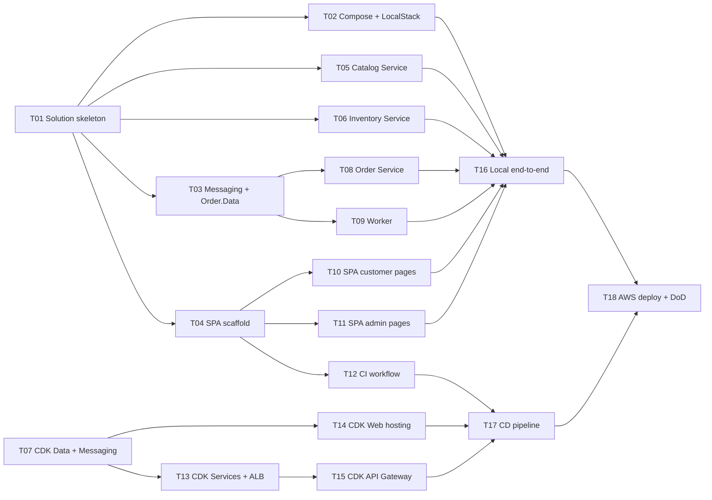

# Tasks

The work to build SuperTickets, split so that as many tasks as possible run at the same time. Each task is sized for one agent (or one person) and one PR.

Tasks are grouped in **waves**. Every task in a wave can start as soon as the tasks it depends on are merged, which is usually earlier than the whole previous wave. The shared interfaces are fixed in [contracts.md](contracts.md), so a task that calls another service builds against a stub of it and does not wait for it.

## Dependency graph

## Waves at a glance

| Wave | Tasks that can run in parallel | Starts when |
|---|---|---|
| 0 | T01 | now (T07 can also start now) |
| 1 | T02, T03, T04, T05, T06, T07 | T01 merged (T07 needs nothing) |
| 2 | T08, T09, T10, T11, T12, T13, T14 | each task's own dependency is merged |
| 3 | T15, T16 | T13 / all app tasks merged |
| 4 | T17, then T18 | CDK stacks and local e2e merged |

Critical path: **T01 → T03 → T08 → T16 → T18**. T03 and T08 are the tasks to staff first and review fastest. With six parallel agents in wave 1 and seven in wave 2, the whole plan is five rounds of merges deep.

## Rules for working in parallel

- **One task, one branch, one PR.** Name the branch after the task (`t05-catalog`).
- **Stay in your folders.** Each task lists the paths it owns. Touching a path owned by another open task means a merge conflict; if you must, keep the change to a few lines and say so in the PR.
- **Shared files** (`docker-compose.yml`, `SuperTickets.slnx`, `infra/cdk/SuperTickets.Cdk/Program.cs`, `CLAUDE.md` commands) are created by one task. Later tasks only append their own lines.
- **Contracts are frozen.** Build against [contracts.md](contracts.md). If a contract is wrong, change contracts.md in your PR and list the tasks it affects in the PR description.
- **Stub, don't wait.** Call other services through a typed `HttpClient`; in tests, replace it with a fake handler that returns the documented responses.
- **Done means:** code, tests passing (`dotnet test` / `npm run build`), and the docs updated if a decision moved (see CLAUDE.md).

---

## Wave 0

### T01 — Solution skeleton

Blocks every .NET task, so keep it small and merge it fast.

- `global.json` (.NET 10 SDK), `Directory.Build.props` (`net10.0`, nullable, implicit usings, `TreatWarningsAsErrors`), `.editorconfig`, `SuperTickets.slnx`.
- Empty projects from the [repo layout](contracts.md#repo-layout): `SuperTickets.Shared`, `Catalog.Api`, `Inventory.Api`, `Order.Api`, `Order.Data`, `Worker`, and the five test projects (xUnit, Testcontainers packages referenced), all in the solution with project references in place.
- In Shared: correlation ID middleware (reads/writes `X-Correlation-Id`, adds it to the logging scope), a `DelegatingHandler` that forwards it on outgoing calls, and a `AddSuperTicketsDefaults()` / `UseSuperTicketsDefaults()` pair wiring it plus ProblemDetails and `/health`.
- Each API: `Program.cs` calling the defaults and serving `/health`. Worker: host that starts and logs.
- A multi-stage `Dockerfile` per service (build context: repo root), listening on 8080.
- CLAUDE.md: replace "no code yet" with the build, test, single-test and `docker compose` commands.

**Owns:** everything at the root, `src/*/` project files and `Program.cs`, `tests/*/` project files.
**Done when:** `dotnet build` and `dotnet test` pass; `docker build -f src/Catalog.Api/Dockerfile .` works and `/health` returns 200.

---

## Wave 1

### T02 — Local stack: Docker Compose + LocalStack

- `docker-compose.yml` with `postgres`, `redis`, `localstack`, `catalog-api`, `inventory-api`, `order-api`, `worker`; ports and env vars exactly as in [contracts.md](contracts.md#configuration); healthchecks; `depends_on` with `condition: service_healthy` (worker waits for `order-api`, which runs the Order migrations).
- `infra/localstack/init-aws.sh` (mounted into `/etc/localstack/init/ready.d`): topic, `payment-queue` + `payment-dlq`, `notification-queue` + `notification-dlq`, redrive policies, raw-delivery subscriptions with `eventType` filter policies.
- Leave a commented placeholder for the `web` service; T04 fills it in.

**Owns:** `docker-compose.yml`, `infra/localstack/`.
**Done when:** `docker compose up` starts everything healthy (the services are still skeletons), and `awslocal sns list-subscriptions` shows both filtered subscriptions.

### T03 — Messaging building blocks + Order database

Unblocks T08 and T09. Highest priority in wave 1.

- `SuperTickets.Shared/Messaging`: the three message records; an `OutboxMessage` entity with a `modelBuilder.AddOutbox()` extension; an `IOutbox.Add(message, correlationId)` helper that adds a row to the current `DbContext`; `OutboxPublisher<TDbContext>` (`BackgroundService`, `FOR UPDATE SKIP LOCKED`, publishes to `Messaging__TopicArn` with the three message attributes, marks `published_at`); `SqsConsumer<TMessage>` base (long poll, deserialize, restore correlation ID, call `HandleAsync`, delete on success, leave on exception).
- `Order.Data`: `OrderDbContext` with `orders`, `payments`, `tickets`, `outbox` exactly as in [contracts.md](contracts.md#orders-orderdata-used-by-orderapi-and-worker), plus the initial migration.
- Tests: outbox round trip against Testcontainers Postgres + LocalStack (row → SNS → SQS with attributes); consumer leaves a message on exception.

**Owns:** `src/SuperTickets.Shared/Messaging/`, `src/Order.Data/`, `tests/SuperTickets.Shared.Tests/`.
**Done when:** tests pass and the migration creates the four tables.

### T04 — SPA scaffold

- Vite + React + TypeScript in `src/web`, `react-router`, `@tanstack/react-query`.
- `vite.config.ts` proxy following the [routing table](contracts.md#routing) (availability route first), targets from env so it works inside Compose.
- `src/api/`: TypeScript types for every DTO in contracts.md, a `fetchJson` that parses Problem Details into a typed error (with `type`), and one function per route.
- App shell with the SPA routes from contracts.md as empty pages.
- A dev `Dockerfile` and the `web` entry in `docker-compose.yml` (replace T02's placeholder).

**Owns:** `src/web/` (shell and `src/api/`), the `web` block in `docker-compose.yml`.
**Done when:** `npm run build` and `npm run lint` pass; `docker compose up web` serves the shell on 5173.

### T05 — Catalog Service

- EF Core `CatalogDbContext` + migration for `events`; migrate on startup.
- Features: `ListEvents` (search, future only, ≤100), `GetEvent`, `CreateEvent`, `UpdateEvent` with the [validation rules](contracts.md#validation), `event_started` rule, and the admin API-key filter on `/admin/*`.
- Create/update call Inventory `PUT /inventory/events/{id}` first (standard resilience handler); map its 409 to `capacity_below_sold`, its failure to 503.
- Redis cache per the [caching contract](contracts.md#caching-catalog): TTL with jitter, version-key invalidation, `X-Cache` header, fallback to Postgres on any Redis error; `/health` reports Redis as degraded.

**Owns:** `src/Catalog.Api/`, `tests/Catalog.Api.Tests/`.
**Done when:** tests cover validation, 401 without key, cache HIT after MISS, invalidation after update, Postgres fallback with Redis stopped, and the Inventory 409 → 409 mapping (Inventory stubbed).

### T06 — Inventory Service

- EF Core `InventoryDbContext` + migration for `stock` and `reservations`; migrate on startup.
- Features: `SetCapacity`, `GetAvailability`, `Reserve`, `Release`, using the SQL in [contracts.md](contracts.md#inventory-inventoryapi).
- Demo toggles `Demo__DelayMs` / `Demo__ErrorRate` on `Reserve` only.

**Owns:** `src/Inventory.Api/`, `tests/Inventory.Api.Tests/`.
**Done when:** tests prove: 20 parallel reserves for 1 ticket → exactly one 201; repeating a reserve or release changes nothing; capacity cut below reserved → 409; release makes the tickets available again.

### T07 — CDK: Data + Messaging stacks

Spec: [aws-publish.md](aws-publish.md) (network, sizing, IAM, routing, stack contents).

Does not depend on any app code; can start before T01.

- `infra/cdk/SuperTickets.Cdk` (C#, `net10.0`, own `cdk.json`), `Program.cs` creating the app.
- `DataStack`: VPC (2 AZs, 1 NAT gateway), RDS Postgres single-AZ with a generated Secrets Manager secret, ElastiCache Redis (single node), security groups exposed as properties for `ServicesStack`.
- `MessagingStack`: same topic, queues, DLQs and filtered raw-delivery subscriptions as `init-aws.sh`.
- Stack outputs: DB endpoint and secret ARN, Redis endpoint, topic ARN, queue URLs.

**Owns:** `infra/cdk/`.
**Done when:** `cdk synth` succeeds; deployed to a sandbox account, `cdk deploy DataStack MessagingStack` completes (or synth only if no account is available yet, stated in the PR).

---

## Wave 2

### T08 — Order Service

Needs T03. Inventory is stubbed in tests.

- Features: `CreateOrder` following the [Order Service flow](contracts.md#order-service-flow) (idempotency key, pending first, reserve, outbox, resume on retry), `GetOrderById` (with tickets), `ExpirePendingOrders` sweeper.
- Inventory client: timeout, retry with backoff + jitter, circuit breaker (`Microsoft.Extensions.Http.Resilience`); breaker open → 503 `dependency_unavailable`.
- Host `OutboxPublisher<OrderDbContext>`; apply `Order.Data` migrations on startup.

**Owns:** `src/Order.Api/`, `tests/Order.Api.Tests/`.
**Done when:** tests cover the same key twice → one order and one outbox row; sold out → 409 and order `cancelled`; Inventory down → 503, then a retry with the same key succeeds; breaker opens after repeated failures; sweeper cancels an old pending order and calls release.

### T09 — Payment/Notification Worker

Needs T03. Inventory is stubbed in tests.

- `PaymentHandler : SqsConsumer<OrderCreated>` and `NotificationHandler : SqsConsumer<PaymentSucceeded>` following the [Worker flow](contracts.md#worker-flow).
- `Payment__FailureRate` and `Demo__NotificationErrorRate` toggles; Inventory release client with retry.

**Owns:** `src/Worker/`, `tests/Worker.Tests/`.
**Done when:** tests cover: the same `OrderCreated` delivered twice → one payment row, one outbox row; failure → order `cancelled` and release called; the same `PaymentSucceeded` twice → exactly `quantity` tickets; order already cancelled by the sweeper → no status change; a throwing handler's message lands in the DLQ after 5 receives (LocalStack).

### T10 — SPA customer pages

Needs T04. Works against the Compose stack or mocked fetches.

- `/`: event list with a search box. `/event/:id`: details, live availability, quantity picker (1–10, capped by availability), "Add to cart" disabled when sold out.
- `/cart`: the one-event cart in `localStorage`, email input, "Place order" sending a fresh `Idempotency-Key` per checkout (kept across retries of the same checkout).
- `/order/:id`: polls every 2 s while `pending`, then shows paid + tickets, or the cancel reason. Human messages for `sold_out` and `dependency_unavailable`.

**Owns:** `src/web/src/pages/customer/`, `src/web/src/cart/`.
**Done when:** `npm run build` passes and the full buy flow works in the browser against `docker compose up`.

### T11 — SPA admin pages

Needs T04.

- `/manage`: event list with edit links and an API-key field kept in `sessionStorage`, sent as `X-Api-Key`.
- `/manage/new`, `/manage/:id`: one shared form with client-side checks mirroring the [validation rules](contracts.md#validation); shows server validation errors per field, and messages for `event_started` and `capacity_below_sold`.

**Owns:** `src/web/src/pages/admin/`.
**Done when:** `npm run build` passes and create/edit works against `docker compose up`.

### T12 — CI workflow

Needs T01 and T04.

- `.github/workflows/ci.yml` on pull requests and `main`: `dotnet build` + `dotnet test` (Docker is available on `ubuntu-latest` for Testcontainers), `npm ci && npm run lint && npm run build` in `src/web`, `cdk synth` once `infra/cdk` exists.

**Owns:** `.github/workflows/ci.yml`.
**Done when:** the workflow is green on its own PR.

### T13 — CDK: Services stack + internal ALB

Spec: [aws-publish.md](aws-publish.md) (network, sizing, IAM, routing, stack contents).

Needs T07 (and the Dockerfiles from T01).

- ECS cluster; four Fargate services from `ContainerImage.FromAsset` (repo root context, each Dockerfile); Catalog with `desiredCount: 2`; the worker with no load balancer.
- Environment from [contracts.md](contracts.md#configuration) with AWS values; `PGPASSWORD` from the RDS secret; `Admin__ApiKey` from a new Secrets Manager secret.
- Internal ALB, one target group per API (health check `/health`), listener rules per the [routing table](contracts.md#routing) including `/inventory/*`; `Services__InventoryUrl` = ALB URL.
- IAM: Order task role can publish to the topic; Worker task role can receive/delete on its two queues. Security groups: ALB → tasks, tasks → RDS/Redis.

**Owns:** `infra/cdk/SuperTickets.Cdk/ServicesStack.cs` (+ one line in `Program.cs`).
**Done when:** `cdk synth` succeeds; if deployed, all services are healthy in their target groups.

### T14 — CDK: Web hosting stack

Spec: [aws-publish.md](aws-publish.md) (network, sizing, IAM, routing, stack contents).

Needs T07 for the app structure only.

- `WebStack`: private S3 bucket with Origin Access Control; CloudFront with the S3 default behavior and a CloudFront Function that rewrites extension-less paths to `/index.html`; `/events*`, `/orders*`, `/admin/*` behaviors to an API origin passed in as a prop (caching disabled, `AllViewerExceptHostHeader`); `BucketDeployment` of `src/web/dist` with invalidation.
- Until T15 lands, the API origin prop can be a placeholder domain.

**Owns:** `infra/cdk/SuperTickets.Cdk/WebStack.cs` (+ one line in `Program.cs`).
**Done when:** `cdk synth` succeeds with a built `src/web/dist`.

---

## Wave 3

### T15 — CDK: API Gateway stack

Spec: [aws-publish.md](aws-publish.md) (network, sizing, IAM, routing, stack contents).

Needs T13.

- `ApiStack`: HTTP API, VPC Link into the VPC, ALB listener integration, the seven public routes only (no `/inventory/*`), default route throttling.
- Wire the API domain into `WebStack`'s API origin.

**Owns:** `infra/cdk/SuperTickets.Cdk/ApiStack.cs`, the wiring in `Program.cs`.
**Done when:** `cdk synth` succeeds; if deployed, `curl <api>/events` returns 200 and `curl <api>/inventory/...` returns 404.

### T16 — Local end-to-end check

Needs T02, T05, T06, T08, T09 (and T10, T11 for the manual UI pass).

- `scripts/smoke.sh` (bash + curl + jq) against `docker compose up`, checking the [application Definition of done](tech-plan.md#definition-of-done-application): create an event (admin key), list it (MISS then HIT), buy end to end until `paid` with tickets, race two orders for the last ticket (one 202, one 409), set `Payment__FailureRate=1` and see `cancelled` plus availability restored, set `Demo__NotificationErrorRate=1` and see the message in `notification-dlq`. Take `BASE_URL` (default `http://localhost:5173`) and skip the toggle checks with `--no-toggles`, so T18 can reuse it on AWS.
- Fix any integration bugs found; each fix goes in the owning project.
- README "Running locally" and CLAUDE.md: add the smoke command.

**Owns:** `scripts/`, integration fixes.
**Done when:** `scripts/smoke.sh` passes from a clean `docker compose up --build`.

---

## Wave 4

### T17 — CD pipeline

Spec: [aws-publish.md](aws-publish.md) (network, sizing, IAM, routing, stack contents).

Needs T12, T14, T15.

- `.github/workflows/deploy.yml` on push to `main` (after CI): AWS credentials via GitHub OIDC (the role is created once by hand or in a small bootstrap stack; document which), `npm ci && npm run build` in `src/web`, `cdk deploy --all --require-approval never`.
- Document the one-time setup (`cdk bootstrap`, the OIDC role, repo variables) in [aws-publish.md](aws-publish.md#deploying).

**Owns:** `.github/workflows/deploy.yml`.
**Done when:** a merge to `main` deploys without manual steps.

### T18 — AWS deploy and Definition of done

Needs T16 and T17. Needs a person with the AWS account.

- Deploy, then check every [published Definition of done](aws-publish.md#definition-of-done) bullet through the CloudFront/API Gateway URL: run `BASE_URL=<cloudfront url> scripts/smoke.sh --no-toggles`, confirm both Catalog tasks serve traffic (task ID in logs), and confirm Redis hits.
- README: set Status to done, with the verification date. Tear down with `cdk destroy --all` if not keeping it running.

**Done when:** every Definition of done bullet is checked off in the PR description.
